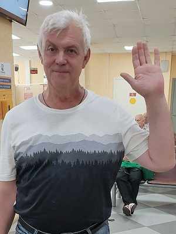

# **Портфолио**

 | Здравствуйте! Меня зовут Олег Гречишников. Я разработчик Web-приложений из Нижнего Новгорода. Моя специализация: разработка Web-приложений на React и Laravel. Я прошел обучение по професиям: "Веб разработчик с нуля" и "Node для backend-разработки" в университете [Нетология](https://netology.ru/).
-------------|----------------   

## Портфолио и сертификаты

Все мои работы и сертификаты Вы увидите [здесь]( hhttps://github.com/GronickWork/portfolio-gronik)  
Все учебные работы [здесь](https://github.com/Gronik4?tab=repositories)

## Контакты
Со мной можно связаться:  
 по почте: gronweb@yandex.ru и golegni@yandex.ru,  
по телефону: +7 906 364 30 28,  
или в соцсетях:  
 |  | 
-------------|----------------|-------------------

Портфолио будет поплнятся по мере приоретения мной новых знаний и навыков.  
Поект в работе [здесь](https://gronickwork.github.io/portfolio-gronik/)